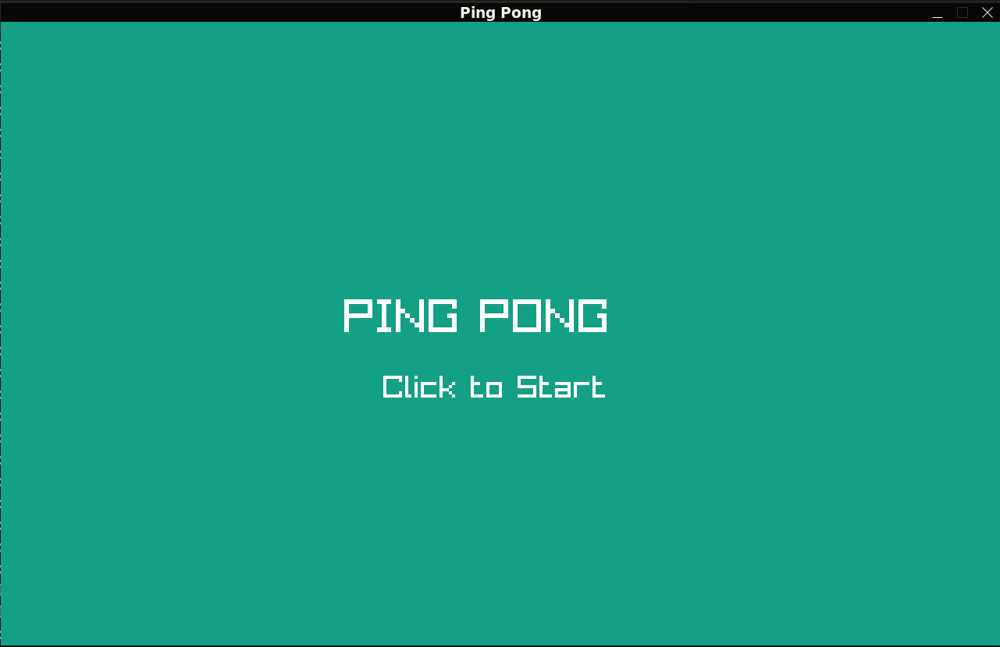
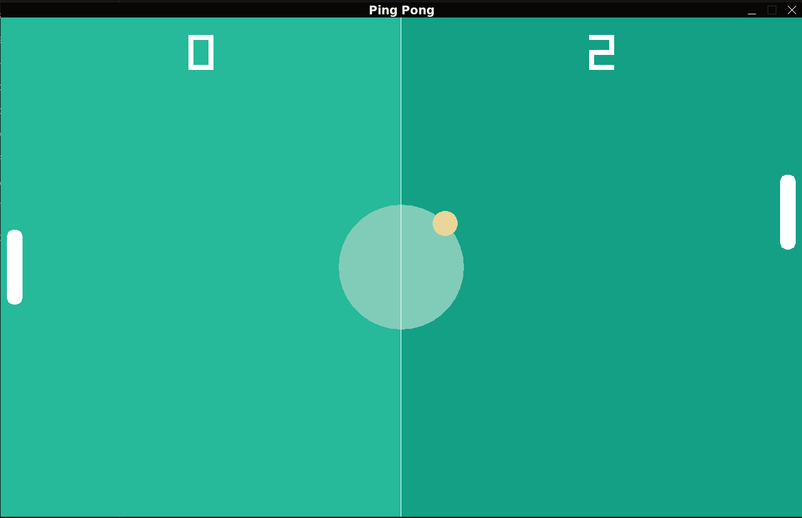

# Pong Game

This folder contains the implementation of the retro **Pong Game**, developed using **Go** and **Raylib**.

## Features
- Player vs. AI gameplay.
- Background music and action sound effects.

## How to Play
- **Objective**: Score points by getting the ball past your opponent's paddle.
- **Controls**:
  - `W`: Move paddle up.
  - `S`: Move paddle down.

