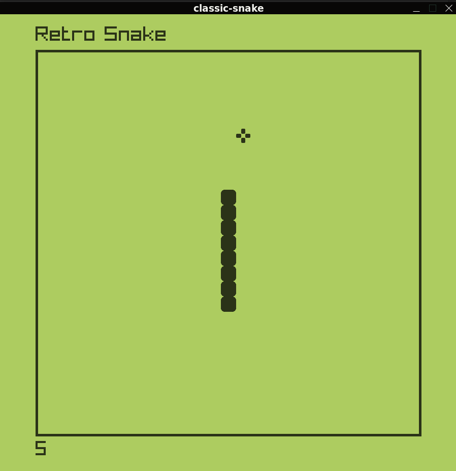

# Snake Game

This folder contains the implementation of the classic **Snake Game**, built using **Go** and **Raylib**. Enjoy the retro feel with smooth graphics and sound effects.

## Features
- Dynamic gameplay.
- Sound effects for actions and events.
- Smooth controls and real-time rendering.

## How to Play
- **Objective**: Grow the snake by eating the food and avoid colliding with the walls or yourself.
- **Controls**:
  - `Arrow Keys`: Move the snake up, down, left, or right.
