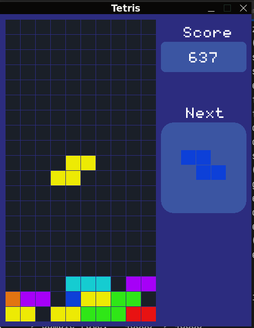

# Tetris Game

This folder contains the implementation of the legendary **Tetris Game**, built using **Go** and **Raylib**. Stack, clear lines, and aim for the highest score!

## Features
- Rotatable and movable tetrominoes.
- Sound effects and background music.

## How to Play
- **Objective**: Arrange falling tetrominoes to clear lines and score points.
- **Controls**:
  - `Left, Right and Down Arrow`: Move tetrominoes left, right, and down.
  - `Up Arrow`: Rotate the tetromino.

